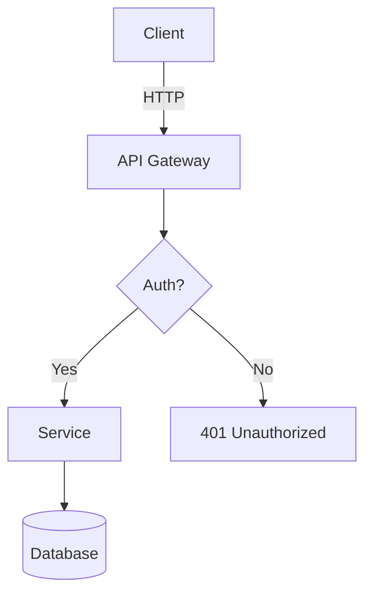
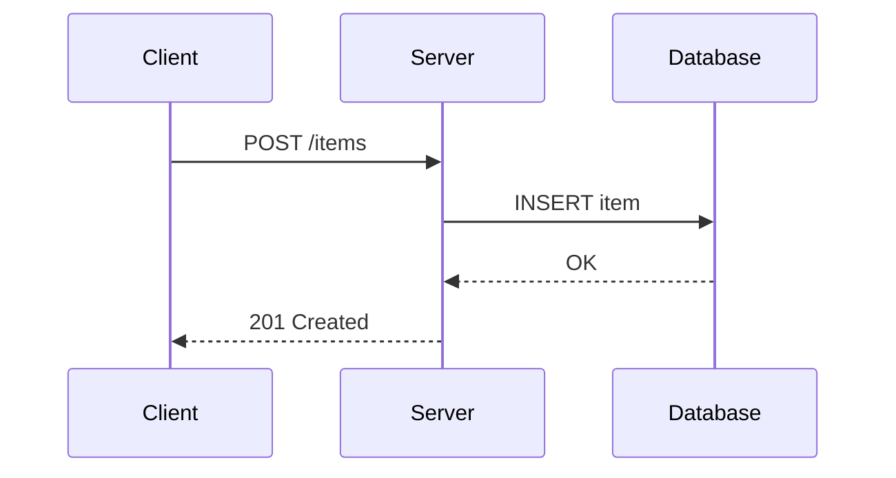
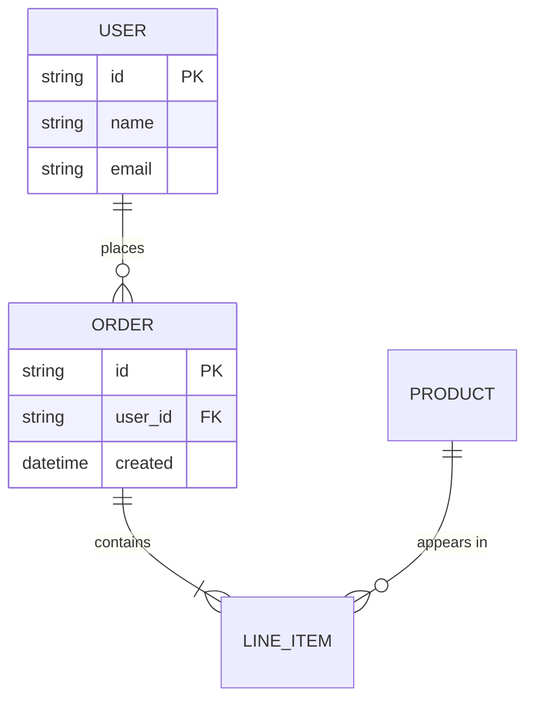
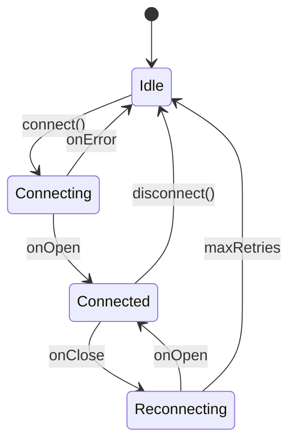
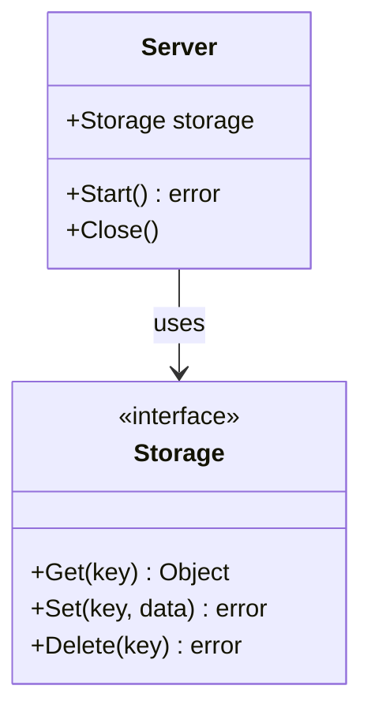
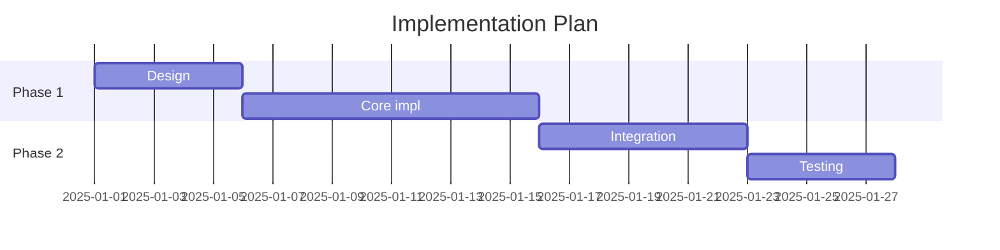
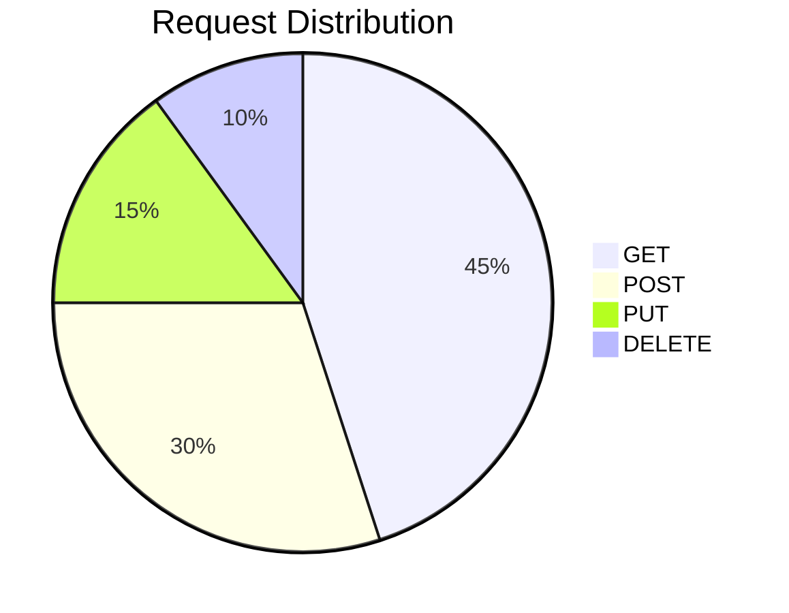
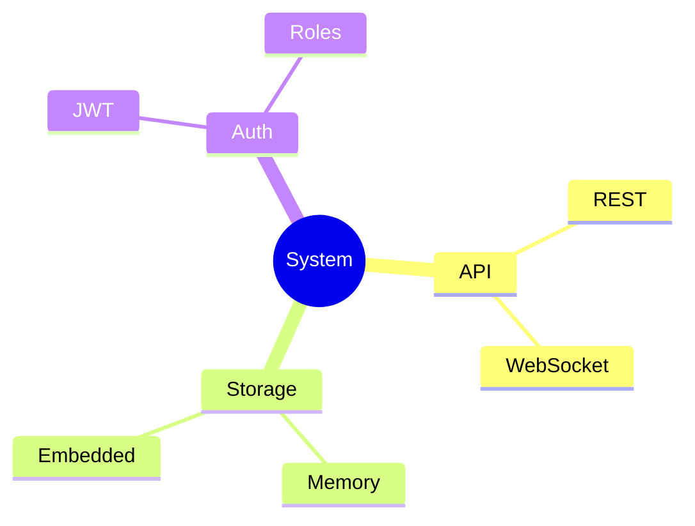

# Mermaid Diagram Reference

> **Agent-facing**: Use Mermaid fenced code blocks (` ```mermaid `) for all diagrams.
> Never use ASCII art for anything beyond 3-4 boxes.
> Never generate images or use external diagram tools.

---

## When to Use Which Diagram

| Planning need | Diagram type | Trigger |
|--------------|-------------|---------|
| System architecture, component layout | `flowchart` | "how components connect", "architecture" |
| Request/response flow, API calls, timing | `sequenceDiagram` | "flow between services", "API sequence", "who calls what" |
| Data model, schema, relationships | `erDiagram` | "data model", "schema", "entities", "relationships" |
| Lifecycle, transitions, modes | `stateDiagram-v2` | "states", "transitions", "lifecycle", "modes" |
| Type hierarchy, interfaces, methods | `classDiagram` | "class structure", "interfaces", "inheritance" |
| Timeline, phases, dependencies | `gantt` | "phases", "timeline", "milestones", "schedule" |
| Proportions, distribution | `pie` | "breakdown", "distribution", "percentage" |
| Brainstorming, topic exploration | `mindmap` | "brainstorm", "explore", "overview of topics" |

---

## Syntax Quick Reference

### Flowchart



Node shapes:
- `[text]` — rectangle
- `(text)` — rounded
- `{text}` — diamond (decision)
- `[(text)]` — cylinder (database)
- `((text))` — circle

Direction: `TD` (top-down), `LR` (left-right), `BT` (bottom-top), `RL` (right-left)

---

### Sequence Diagram



Arrow types:
- `->>` solid with arrowhead
- `-->>` dashed with arrowhead
- `--)` solid async
- `---)` dashed async

Blocks: `alt`/`else`, `loop`, `opt`, `par`, `critical`, `break`

---

### ER Diagram



Cardinality: `||` exactly one, `o|` zero or one, `}|` one or more, `}o` zero or more

---

### State Diagram



Special states: `[*]` start/end, `state "Name" as alias`

Composite: `state GroupName { ... }`

---

### Class Diagram



Visibility: `+` public, `-` private, `#` protected

Relations: `-->` dependency, `--|>` inheritance, `..|>` implementation, `--*` composition, `--o` aggregation

---

### Gantt



Task types: `:active`, `:done`, `:crit` (critical path), `:milestone`

---

### Pie



---

### Mindmap



---

## Anti-Patterns

| Do NOT | Do instead |
|--------|-----------|
| ASCII art for anything beyond 3-4 boxes | Mermaid fenced code block |
| External tools (draw.io, Excalidraw) | Mermaid in markdown |
| Image generation / screenshots | Text-based Mermaid |
| Overly complex single diagram (>20 nodes) | Split into multiple focused diagrams |
| Diagram without context | Always precede with a sentence explaining what the diagram shows |
| Decorative diagrams | Every diagram must convey information not already in the text |

---

## Rules

1. **Always use ` ```mermaid ` fenced code blocks** — renders natively in GitHub, VS Code, Windsurf
2. **One diagram per concept** — don't combine architecture + data model + state in one diagram
3. **Label all arrows** — unlabeled arrows force the reader to guess
4. **Use aliases for long names** — `participant S as AuthService` not `participant AuthenticationService`
5. **Direction matters** — use `LR` for flows/pipelines, `TD` for hierarchies/architectures
